# Waza

A BJJ training tracker for iOS 26. Log sessions, check in at your gym, track techniques, earn XP, and watch your game grow.

[Available on the App Store →](https://apps.apple.com/app/id6759821384)

> **For engineers and recruiters:** jump to [Engineering Overview](#engineering-overview) or the featured [CoreInteractor refactor case study](./docs/refactor-coreinteractor-case-study.md) ([open as PR #1](https://github.com/MarkMartin2077/Waza/pull/1)).

---

## Screenshots

<p align="center">
  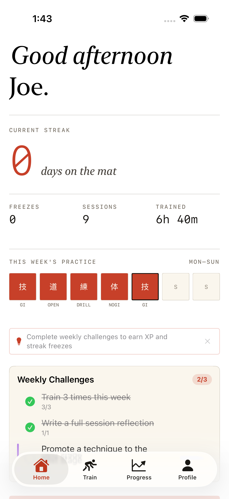
  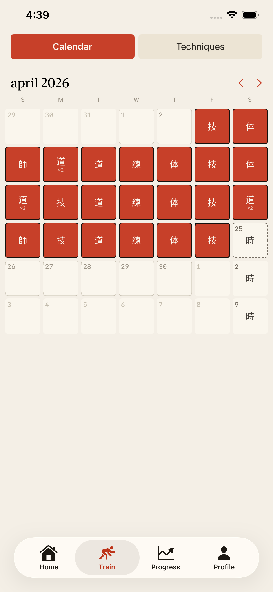
  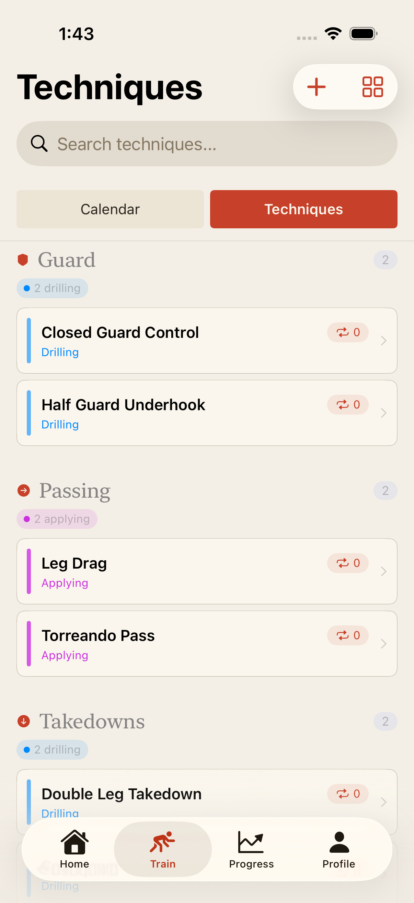
  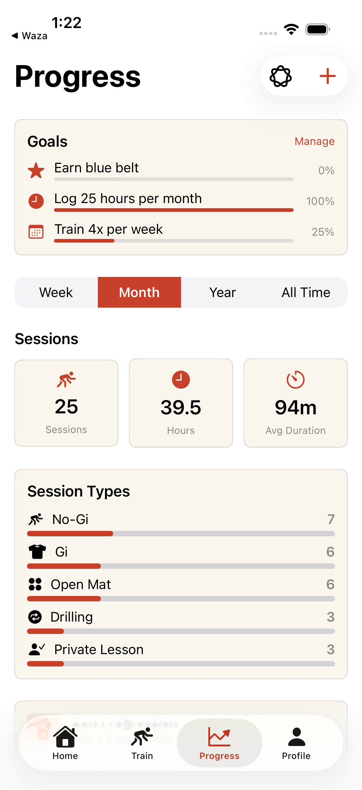
</p>

<p align="center">
  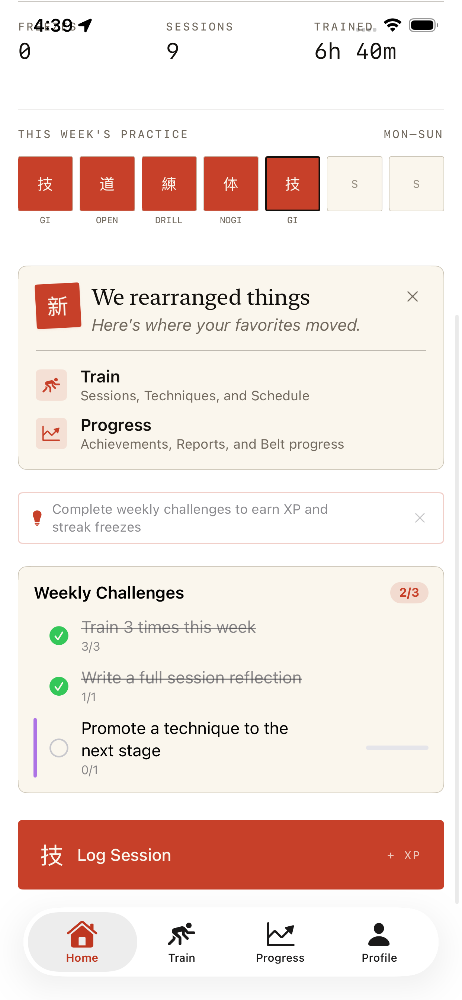
  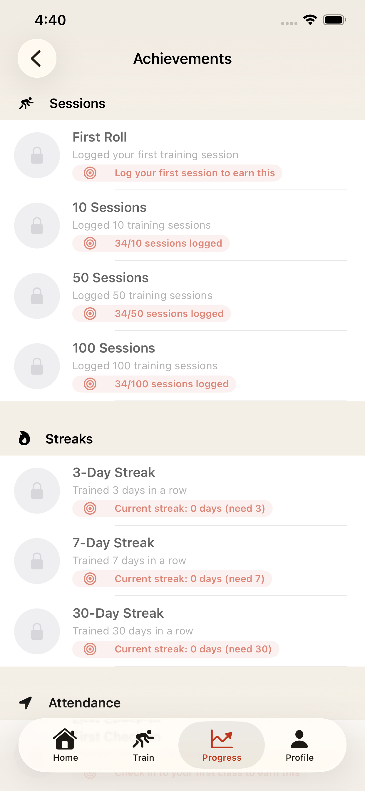
  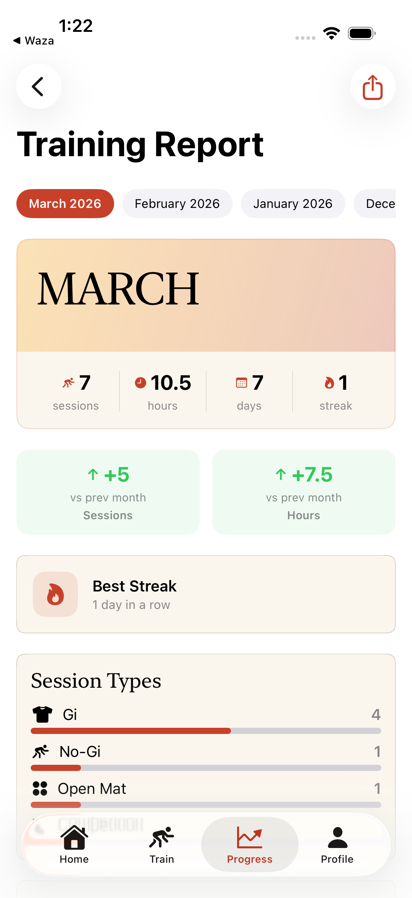
  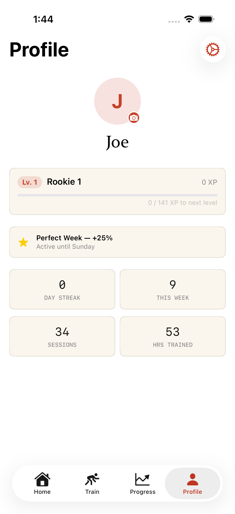
</p>

---

## What You Can Do (User-Facing Features)

### Log Your Training
- Track every session: Gi, No-Gi, Open Mat, Competition, Drilling, Private Lesson
- Tag techniques you worked on and write reflections on what clicked
- Record your mood before and after training to spot patterns
- Search and filter your entire training history by technique, gym, mood, or session type

### Your Training Calendar
- A single monthly grid for everything that happened on the mat and everything coming up
- Past sessions stamp the day with the session type kanji (`技`, `道`, `練`, `体`)
- Scheduled classes show as outlined `時` markers on future days
- Tap any day to drill into session details, check in to an upcoming class, or add a class to your schedule

### Check In at Your Gym
- Get notified when you arrive at your gym — tap to check in
- See a personalized AI message after each check-in
- Live timer on your Lock Screen while you train

### Rank Up with XP
- Earn XP for every session, check-in, and milestone
- Climb through 8 ranked leagues: Rookie, Scrapper, Grappler, Contender, Adept, Ace, Vanguard, Grandmaster — plus Legend for the dedicated
- Boost your XP with streak multipliers, perfect week bonuses, and random Fire Rounds (2x XP for 24 hours)
- Full-screen celebrations when you level up or unlock a new streak tier

### Build Your Technique Journal
- Your personal technique library grows automatically as you train
- Track where each technique stands: Learning, Drilling, Applying, or Polishing
- See a visual map of your entire game at a glance
- Get nudged when a technique is ready to promote to the next stage

### Crush Weekly Challenges
- 3 new challenges every Monday, tailored to your training gaps
- Challenges push you to try new session types, techniques, gyms, and habits
- Earn XP, streak freezes, and achievements for completing them

### Review Your Month
- Automatic monthly training report with stats, streaks, mood trends, and highlights
- Compare month over month to see your trajectory
- Browse reports for the last 6 months
- Share a branded recap card to your socials

### Share Your Progress
- Generate shareable cards for sessions, streaks, level-ups, and monthly recaps
- Dark-themed cards with your name and Waza branding — ready for Instagram Stories

### Track Your Progress
- See your session count, hours, and averages by week, month, year, or all time
- Set training goals and track them with visual progress bars
- Get AI-powered weekly summaries and training insights

### Manage Your Schedule
- Add your gyms with location and map
- Set up recurring class reminders
- Never miss a session with customizable notifications

### Stay Motivated
- Daily training streaks with warnings before they break
- Use streak freezes to protect your streak on rest days
- 13 achievements to unlock across sessions, streaks, attendance, and goals
- Home screen widgets for your streak and next class

---

## Engineering Overview

A solo iOS portfolio project designed to demonstrate production-grade engineering on a real (shipped) app.

### Stack

- **Language:** Swift 6 (strict concurrency enabled)
- **UI:** SwiftUI, iOS 26 — Live Activities, widgets, Apple Intelligence integration
- **State:** `@Observable` classes, `@MainActor` discipline, structured concurrency
- **Persistence:** SwiftData + FileManager (local cache, offline-first) with Firestore sync
- **Backends:** Firebase (auth, storage, messaging, crashlytics), RevenueCat (IAP), Mixpanel (analytics)
- **Architecture:** VIPER per screen + RIBs-style core coordination

### Code quality signals

- **~85 unit tests** across business logic (challenge generation, evaluation, monthly report aggregation, technique CRUD, calendar month building)
- **XCUI screenshot-automation test** drives the signed-in app through 10 key screens and writes PNGs to disk — reproducible visual review
- **SwiftLint enforced** (line length, file length, identifier name, function parameter count, todo violations surface in CI)
- **Swift 6 strict concurrency** clean — no `@unchecked Sendable` escape hatches in new code
- **Zero `TODO` / `FIXME` / `HACK` comments** in production source as of the most recent preship pass

### Architecture at a glance

Every screen follows VIPER (View → Presenter → Router + Interactor). The three RIBs-core types (`CoreRouter`, `CoreInteractor`, `CoreBuilder`) implement every screen's Router and Interactor protocols via extensions, so screens stay decoupled while sharing one coordination layer. Managers live behind protocols, are registered in a single `DependencyContainer`, and are resolved through the `CoreInteractor` — views never touch them directly.

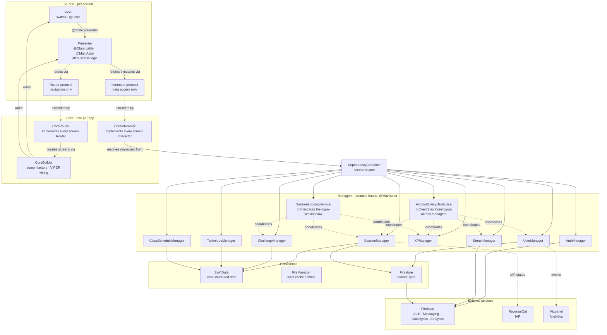

**Data flow is strictly one-way:**

```
View  →  Presenter  →  Interactor  →  Manager  →  Service (local / remote)
View  ←  Presenter  ←  Interactor  ←  Manager  ←  Service
```

Views never reach into the Interactor or Manager layer directly; Presenters never touch Managers directly — always through the Interactor protocol. That discipline is what makes every screen unit-testable with a plain `StubInteractor` and `SpyRouter` (see `CalendarPresenterTests.swift` for a representative harness).

**Build configurations:**

| Scheme | Managers wired to | Purpose |
|---|---|---|
| `Waza - Mock` | `MockAuthService`, `MockSessionServices`, `MockStreakServices`, … | No Firebase · no network · seeded fixtures |
| `Waza - Development` | `FirebaseAuthService`, `ProductionGoalServices`, … | Firebase Dev project · real analytics |
| `Waza - Production` | Same as Dev but against Prod Firebase + RevenueCat production keys |

`Dependencies.swift` is the single construction site — it switches on the scheme's `BuildConfiguration` enum and registers the right service implementations into `DependencyContainer`. Swapping schemes swaps *implementations*, never protocols.

### Featured case study

📖 **[The CoreInteractor refactor](./docs/refactor-coreinteractor-case-study.md)** — detailed walkthrough of the decision to consolidate 7 domain extension files into one file plus 3 orchestration services. Covers context, options considered, tradeoffs accepted, and a real bug the refactor surfaced (`trainDuration` challenges could never complete). Also available as [PR #1](https://github.com/MarkMartin2077/Waza/pull/1) for reviewing the structured diff.

### Places to look for judgment, not just features

- **[`CalendarMonthBuilder.swift`](./Waza/Managers/BJJ/CalendarMonthBuilder.swift)** — pure static struct with injected `calendar` and `now`. Powers the Calendar tab's 42-cell monthly grid. Expands recurring schedules into concrete occurrences, buckets sessions per day, stays test-friendly across DST boundaries. 9 unit tests, no hidden wall-clock dependencies.

- **[`MonthlyReportCalculator.swift`](./Waza/Managers/BJJ/MonthlyReportCalculator.swift)** — pure static enum. Extracted from a 300-line `CoreInteractor+BJJ.swift` extension specifically to make the aggregation logic unit-testable without spinning up 6 managers.

- **[`ChallengeGenerator.swift`](./Waza/Managers/BJJ/ChallengeGenerator.swift)** — weighted-selection algorithm with category-variety enforcement. Deterministic via injectable RNG seed; the unit tests exercise the seed to verify variety and distribution.

- **[`CoreInteractor.swift`](./Waza/Root/RIBs/Core/CoreInteractor.swift)** — the result of a deliberate refactor that consolidated 7 domain-grouped extension files (`+BJJ.swift`, `+Gamification.swift`, etc.) into a single interactor plus 3 orchestration services (`AccountLifecycleService`, `SessionLoggingService`, `MonthlyReportBuilder`). See the [case study](./docs/refactor-coreinteractor-case-study.md) for rationale and the bug it surfaced.

- **[`SessionLoggingService.swift`](./Waza/Managers/BJJ/SessionLoggingService.swift)** — cross-manager orchestration for the "log a session" flow: session creation, XP calculation with multipliers, streak updates, achievement checks, weekly challenge evaluation, toast firing. All writes log to Crashlytics on failure — no silent `try?` swallows.

- **[`Waza/Utilities/WazaCornerRadius.swift`](./Waza/Utilities/WazaCornerRadius.swift) + [`WazaFont.swift`](./Waza/Utilities/WazaFont.swift)** — design tokens with documented semantics (small / standard / hero radii; typography ladder). Added during a UI/UX consistency pass.

- **[`WazaUITests/ScreenshotTests.swift`](./WazaUITests/ScreenshotTests.swift)** — opt-in test that launches with a `MARKETING_MODE` flag and captures App-Store-ready screenshots.

- **[`MarketingDataSeeder.swift`](./Waza/Utilities/MarketingDataSeeder.swift)** — separates aspirational-user seeding for screenshots from the default beginner mock. Honest about its limitations in file-level docs.

### Build

Three schemes:

| Scheme | Purpose |
|---|---|
| **Waza - Mock** | Fast iteration, no Firebase, seeded mock data. Use for 90% of dev. |
| **Waza - Development** | Firebase Dev credentials, real analytics, real auth |
| **Waza - Production** | Production Firebase + RevenueCat |

Run tests from the Mock scheme:

```bash
xcodebuild test -project Waza.xcodeproj \
  -scheme "Waza - Mock" \
  -destination "platform=iOS Simulator,name=iPhone 17 Pro"
```

Regenerate App Store screenshots (output lands in `./Screenshots/`):

```bash
xcodebuild test -project Waza.xcodeproj \
  -scheme "Waza - Mock" \
  -destination "platform=iOS Simulator,name=iPhone 17 Pro" \
  -only-testing:WazaUITests/ScreenshotTests
```

---

## Full Screenshot Tour

<table>
  <tr>
    <td></td>
    <td></td>
    <td></td>
  </tr>
  <tr>
    <td align="center"><b>Home</b><br/>Greeting, streak hero, weekly grid, log CTA</td>
    <td align="center"><b>Weekly Challenges</b><br/>3 rotating challenges, progress bars</td>
    <td align="center"><b>Calendar</b><br/>Past sessions + future classes in one grid</td>
  </tr>
  <tr>
    <td></td>
    <td></td>
    <td>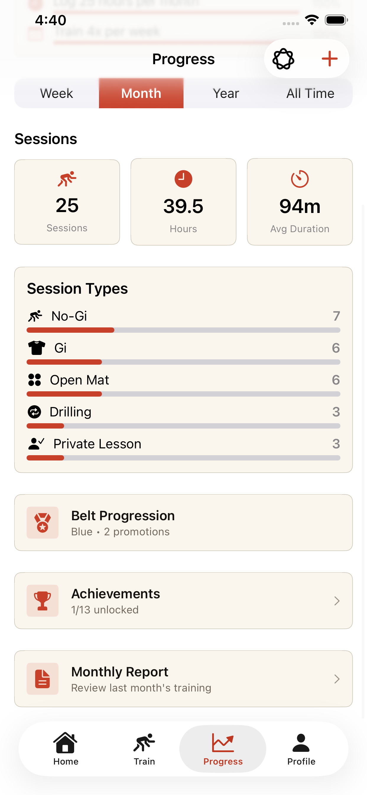</td>
  </tr>
  <tr>
    <td align="center"><b>Techniques</b><br/>Auto-organized by category and stage</td>
    <td align="center"><b>Progress</b><br/>Goals, stats, session breakdown</td>
    <td align="center"><b>Progress · More</b><br/>Belt progression, achievements, monthly report</td>
  </tr>
  <tr>
    <td></td>
    <td></td>
    <td></td>
  </tr>
  <tr>
    <td align="center"><b>Achievements</b><br/>Session, streak, attendance unlocks</td>
    <td align="center"><b>Monthly Report</b><br/>Trajectory + month-over-month delta</td>
    <td align="center"><b>Profile</b><br/>Level, XP, lifetime stats</td>
  </tr>
  <tr>
    <td>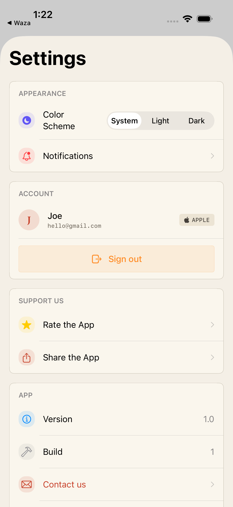</td>
    <td></td>
    <td></td>
  </tr>
  <tr>
    <td align="center"><b>Settings</b><br/>Anonymous → Apple/Google upgrade path</td>
    <td></td>
    <td></td>
  </tr>
</table>

---

## Requirements

- iPhone running iOS 26 or later
- Apple Intelligence features require iPhone 15 Pro or later

## Download

[Available on the App Store](https://apps.apple.com/app/id6759821384)
