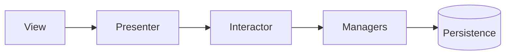

# Waza

A BJJ training tracker for iOS 26. Log sessions, check in at your gym, track techniques, earn XP, and watch your game grow.

[Available on the App Store →](https://apps.apple.com/app/id6759821384)

<p align="center">
  
  
  
  
</p>

## Features

- **Log every session** — Gi, No-Gi, Open Mat, Competition, Drilling, Private Lesson — with technique tags, reflections, and pre/post-session mood.
- **A unified training calendar** that stamps past sessions with a kanji and marks upcoming classes on the same monthly grid.
- **Gym check-ins** with a personalized AI message when you arrive, plus attendance-driven perfect-week bonuses.
- **XP, streaks, and freezes** tuned for a 3–5x/week sport — earn freezes from first session, monthly, perfect weeks, and weekly-challenge progress.
- **Weekly challenges** generated from your training gaps. Sweep all three to unlock a Fire Round — 24 hours of doubled XP.
- **Technique journal** that auto-grows as you train, with a four-stage progression ladder from Learning to Polishing.
- **Monthly report** — automatic trajectory with stats, streaks, mood trends, and shareable recap cards.
- **Belt progression, goals, achievements, and a next-class home-screen widget.**

## Engineering

- **Swift 6 / SwiftUI / iOS 26.** Strict concurrency, `@Observable` + `@MainActor` discipline throughout.
- **VIPER per screen + RIBs-style core.** Every screen is a pure unit-test harness — `StubInteractor` + `SpyRouter` covers the layer.
- **SwiftData + FileManager** for offline-first local cache; Firestore for sync. Firebase (auth, messaging, crashlytics), RevenueCat (IAP), Mixpanel (analytics).



Three schemes — `Mock`, `Development`, `Production` — switch service implementations from a single construction site in `Dependencies.swift`. Run from the Mock scheme for 90% of development:

```bash
xcodebuild test -project Waza.xcodeproj \
  -scheme "Waza - Mock" \
  -destination "platform=iOS Simulator,name=iPhone 17 Pro"
```

## Requirements

iPhone running iOS 26 or later. Apple Intelligence features require iPhone 15 Pro or later.

## Credits

Waza stands on the shoulders of [Swiftful Thinking](https://github.com/SwiftfulThinking).
